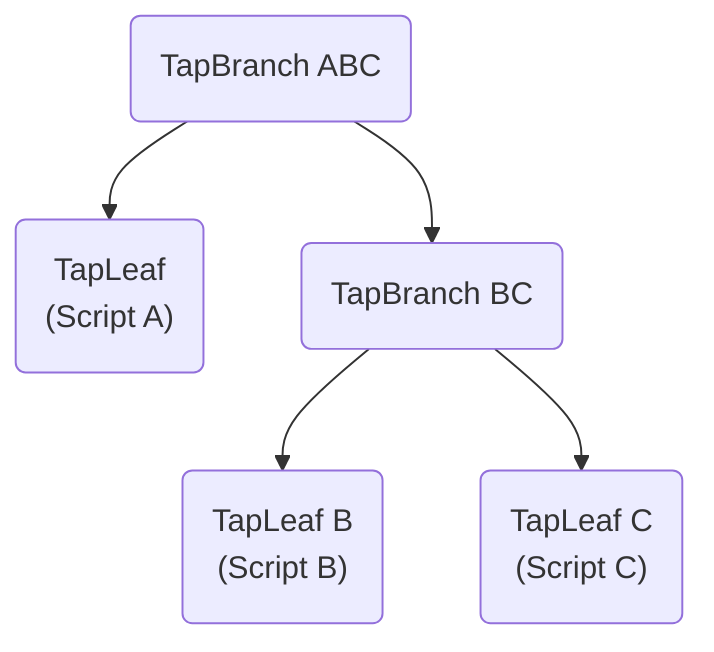

import Tabs from '@theme/Tabs';
import TabItem from '@theme/TabItem';
import FeaturedImage from '@site/assets/taproot-lock-and-spend-taproot-script-path-with-python.jpg';

<Head>
  <meta property="og:image" content={`https://bitcoindocs.org${FeaturedImage}`} />
  <meta name="twitter:image:src" content="https://bitcoindocs.org${FeaturedImage}" />
  <meta property="og:image:type" content="image/jpeg" />
</Head>


Learn how to lock your funds in Python using Taproot and spend them using Taproot script path transaction. This guide
is a continuation of [Stupid Simple Locking Script With Python](blog/2023-12-15-stupid-simple-locking-script-with-python.mdx)
where we learned how to lock our funds using a P2SH address.

<!--truncate-->

Pre-requisites:
- basic knowledge of taproot and its phrases (tapleaf, tapbranch, control block, internal pubkey,...)
- `buidl` or `bitcointx` python library
- running or having access to regtest node 

Instead of defining only one way of spending the locked sats, we'll define 3 equations and the solution to any of the
equation will unlock the funds.

:::warning
Script used in this article is for educational purposes only, please don't be a degen and use this with real money.
:::

Here are the equations that we will use:

1. Script A: x + 1 = 2
2. Script B: x + 2 = 4
3. Script C: x + 1 = 5

Each equation is its own script and is "wrapped" in a TapLeaf. When there are multiple scripts defined we wrap those
into branches called TapBranch. See the below diagram as an example:




Below we use two Python libraries to demonstrate how to create and spend a P2TR script path:

- [bitcointx](https://github.com/Simplexum/python-bitcointx/)
- [buidl](https://github.com/buidl-bitcoin/buidl-python/)

## Create a locking address

As explained in the previous section, here we will construct an address that locks its funds that will only be
spendable if any of the 3 mathematical equations get solved.

<Tabs groupId="python-lib">
  <TabItem value="bitcointx" label="bitcointx">
  ```py
  import bitcointx as btc

  # `select_chain_params` must be run before other imports!
  btc.select_chain_params("bitcoin/regtest")

  from bitcointx.wallet import CCoinKey

  from bitcointx.core import COutPoint, CTxIn, CTxOut, CMutableTransaction, CTxInWitness, b2x, lx, CTxWitness
  from bitcointx.core.script import CScript, OP_ADD, OP_1, OP_2, OP_4, OP_5, OP_EQUAL, TaprootScriptTree, CScriptWitness
  from bitcointx.wallet import P2TRCoinAddress, P2WPKHBitcoinRegtestAddress
  from binascii import hexlify, unhexlify

  # define the 3 spending equations
  script_a = CScript([OP_1, OP_ADD, OP_2, OP_EQUAL], name="a")
  script_b = CScript([OP_2, OP_ADD, OP_4, OP_EQUAL], name="b")
  script_c = CScript([OP_1, OP_ADD, OP_5, OP_EQUAL], name="c")

  # bitcointx will build a tree of branches and leaves for you
  tree = TaprootScriptTree([script_a, script_b, script_c])

  # create a provably unspendable public key in order to
  # make the coins spendable ONLY using the script path
  internal_pubkey = CCoinKey.from_secret_bytes(unhexlify("50929b74c1a04954b78b4b6035e97a5e078a5a0f28ec96d547bfee9ace803ac0")).xonly_pub
  tree.set_internal_pubkey(internal_pubkey)
  addr = P2TRCoinAddress.from_script_tree(tree)
  print("Send 0.01 BTC to the following address: {}".format(addr))
  # prints: Send 0.01 BTC to the following address: bcrt1p6zvv97wg8j0hec7uhatuaqtqksj88wqk0xqq8q98fr9zt4ecy4hqwgv6k2
  ```
  </TabItem>
  <TabItem value="build" label="buidl">
  ```py
  from buidl.ecc import S256Point
  from binascii import unhexlify
  from buidl.taproot import TapLeaf, TapBranch, TapScript
  from buidl.op import encode_num
  from buidl.tx import Tx, TxIn, TxOut
  from buidl.script import P2WPKHScriptPubKey, decode_bech32

  # script_a = Script([op_1, op_add, op_2, op_equal])
  # script_b = Script([op_2, op_add, op_6, op_equal])
  # script_c = Script([op_2, op_add, op_3, op_equal])

  # buidl doesn't have constants/variables defined for op codes hence why
  # we use use their integer values
  script_a = TapScript([81, 147, 82, 135])
  script_b = TapScript([82, 147, 84, 135])
  script_c = TapScript([81, 147, 85, 135])

  leaf_a = TapLeaf(script_a)
  leaf_b = TapLeaf(script_b)
  leaf_c = TapLeaf(script_c)

  # we need to construct a tree of branches ourselves
  branch_bc = TapBranch(leaf_b, leaf_c)
  branch_abc = TapBranch(leaf_a, branch_bc)

  internal_pubkey = S256Point.parse_xonly(unhexlify("50929b74c1a04954b78b4b6035e97a5e078a5a0f28ec96d547bfee9ace803ac0"))
  addr = internal_pubkey.p2tr_address(branch_abc.hash(), network="regtest")
  print("Send 0.01 BTC to the following address: {}".format(addr))
  # prints: Send 0.01 BTC to the following address: bcrt1py7e8e0q7pdkxwyp2tjn65k4kd5kgch0aqe03jzjczn96xat6nwjswsu892
  ```
  </TabItem>
</Tabs>

After getting an address, send 0.01 BTC to it. In the next step, we'll solve one of the equations and spend those funds.

:::note
We use a provably unspendable public key (public key without a private key) `50929b74c1a04954b78b4b6035e97a5e078a5a0f28ec96d547bfee9ace803ac0`
to enforce that the locked Bitcoins can only be spent by solving a mathematical equation and not also by using
a keypath spend path. A more detailed and technical explanation can be found in [BIP-341](https://github.com/bitcoin/bips/blob/master/bip-0341.mediawiki#constructing-and-spending-taproot-outputs).
:::

## Unlock and spend funds
In this example, we will unlock the funds by solving the 2nd mathematical equation (`x + 2 = 4`). In order to unlock
the funds we must provide a value `X`. After doing some "heavy maffs", we realize that `x` = 2`.

This means that when constructing our spending transaction we must:

- provide the answer to the equation (x=2)
- provide the script that we are spending (`script_b`)
- provide a control block (the control block contains the Merkle tree path to the leaf we're using to unlock the coins)

<Tabs groupId="python-lib">
  <TabItem value="bitcointx" label="bitcointx">
  ```py
  # set the new destination address
  destination_address = P2WPKHBitcoinRegtestAddress('bcrt1q2h6auzh30jxlq5q3az2wzmfa5zx9nu9rqnn4v0')

  # get the txid and index of the transaction that funded the
  # address which we generated above
  txid = "d78b711e00e15683e4344a2e21f4fc46d0a3148640181616bf8533b92b76c169"
  vout = 1

  # construct a spending transaction
  script, control_block = tree.get_script_with_control_block('b')

  txin = CTxIn(COutPoint(lx(txid), vout))
  txout = CTxOut(998000, destination_address.to_scriptPubKey())
  tx = CMutableTransaction([txin], [txout])

  # we pass the encoded num 2 (x + 2 = 4; x = 4 - 2; x = 2) which is the answer
  # to script b that we are using to unlock the funds
  ctxinwitnesses = [CTxInWitness(CScriptWitness([2, script, control_block]))]
  tx.wit = CTxWitness(ctxinwitnesses)
  print("Serialized transaction, ready to be broadcasted: \n{}".format(b2x(tx.serialize())))
  # prints: Serialized transaction, ready to be broadcasted: 
  # 0200000000010169c1762bb93385bf161618408614a3d046fcf4212e4a34e48356e1001e718bd70100000000ffffffff01703a0f000000000016001455f5de0af17c8df05011e894e16d3da08c59f0a3030102045293548761c01e2cd43aa1993fa0c794bdb6d46bf020b8ac8e94b4ba8ef0afdf4bc7e7c69a18d1e739a26b4901006173fdaabda58fee852adf52961b72599c9028bc3c2416726d44bd01a69b7813aa96283e235ae783e12e45017e8368bce37cec085d5b823d00000000
  ```
  </TabItem>
  <TabItem value="build" label="buidl">
  ```py
  # set the new destination address
  destination_address = "bcrt1qjpy5vd3au8evkh8y88j76quyjgz3kfu9p2yqkc"

  # get the txid and index of the transaction that funded the address which we generated above
  txid = "113617f7090edd587364c57a16fa3102288cdc1dd083f47f50d3ae94cb48a812"
  vout = 0

  control_block = branch_abc.control_block(internal_pubkey, leaf_b)

  tx_in = TxIn(bytes.fromhex(txid), vout)
  # we pass the encoded num 2 (x + 2 = 4; x = 4 - 2; x = 2) which is the answer
  # to script b that we are using to unlock the funds
  tx_in.witness.items = [encode_num(2), leaf_b.tap_script.raw_serialize(), control_block.serialize()]
  tx_ins = [tx_in]
  tx_outs = [TxOut(998000, P2WPKHScriptPubKey(decode_bech32(destination_address)[2]))]

  tx = Tx(2, tx_ins, tx_outs, network="regtest", segwit=True)
  print("Serialized transaction, ready to be broadcasted: \n{}".format(tx.serialize().hex()))
  # prints: Serialized transaction, ready to be broadcasted: 
  # 0200000000010112a848cb94aed3507ff483d01ddc8c280231fa167ac5647358dd0e09f71736110000000000ffffffff01703a0f0000000000160014904946363de1f2cb5ce439e5ed038492051b2785030102045293548761c1f006a18d5653c4edf5391ff23a61f03ff83d237e880ee61187fa9f379a028e0ad1e739a26b4901006173fdaabda58fee852adf52961b72599c9028bc3c2416726d44bd01a69b7813aa96283e235ae783e12e45017e8368bce37cec085d5b823d00000000
  ```
  </TabItem>
</Tabs>

You should be able to broadcast the above raw transaction and spend the locked funds!

:::info
Not sure if you've noticed, but we did not have to sign the transaction, this is because we intentionally only wanted to
lock our funds by a stupid simple mathematical equation.
:::
