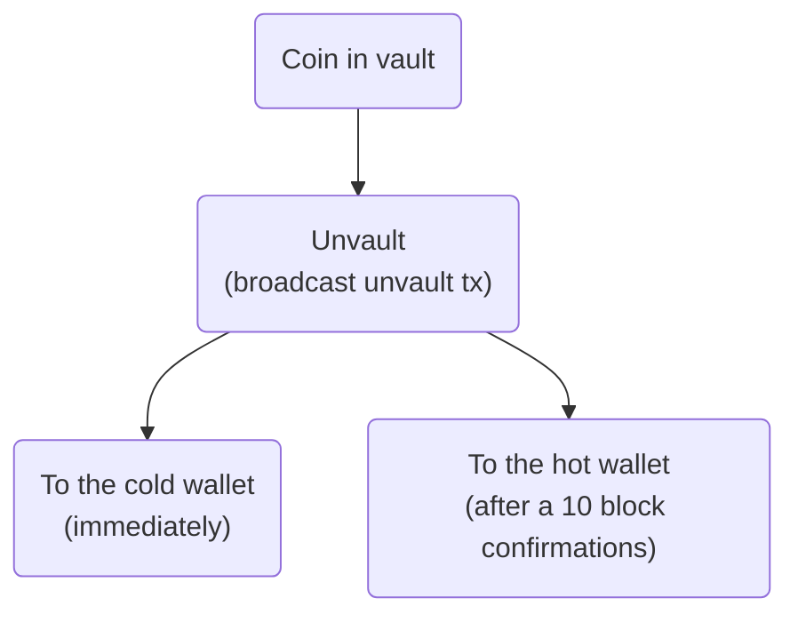

## Code Example

Let's create a simple vault with OP_CTV. This code is heavily inspired by jamesob's 
[simple-ctv-vault](https://github.com/jamesob/simple-ctv-vault/).

To follow along you must:
- run [Bitcoin inquisitions](https://github.com/bitcoin-inquisition/bitcoin/) which has OP_CTV enabled
- run Bitcoin regtest network with `-txindex` flag enabled
- have basic understanding of `bitcoin-cli`
- install [python-bitcoinlib](https://pypi.org/project/python-bitcoinlib/) library for Python code

Our goal in this example will be to create create a simple vault, where only way we can spend from it will be by
sending an unvaulting transaction. Once unvaulting transaction is broadcasted we can move our coins to either our 
cold address instantly or by waiting 10 blocks and moving it to our hot addesss. 



### Preparations

1. Create hot and cold address and get their private keys

We will need this to play pretend that the hot address is an address in our mobile app wallet and the cold address
is an address in our cold storage hardware wallet.

```sh
$ ./bitcoin-cli getnewaddress "our hot address" "bech32"
bcrt1qmhmal38nwrhjg9nazhw4fsllpkzsx4q7e7veww
$ ./bitcoin-cli dumpprivkey bcrt1qmhmal38nwrhjg9nazhw4fsllpkzsx4q7e7veww
cQM9nTzpDEjqWPuCKuiotWbc9pDVo2rWcyeBm4zNSWXE3m5Q6xWR
```

```sh
$ ./bitcoin-cli getnewaddress "our cold address" "bech32"
bcrt1qwgxytnwcjp0pmmatkderycd8zny9cawmz9sn3k
$ ./bitcoin-cli dumpprivkey bcrt1qwgxytnwcjp0pmmatkderycd8zny9cawmz9sn3k
cSpgCUQkEt2ZoT4KLLvYQPe6MS8qubf2CDsULiKLtYqJ2NCqLBb3
```
